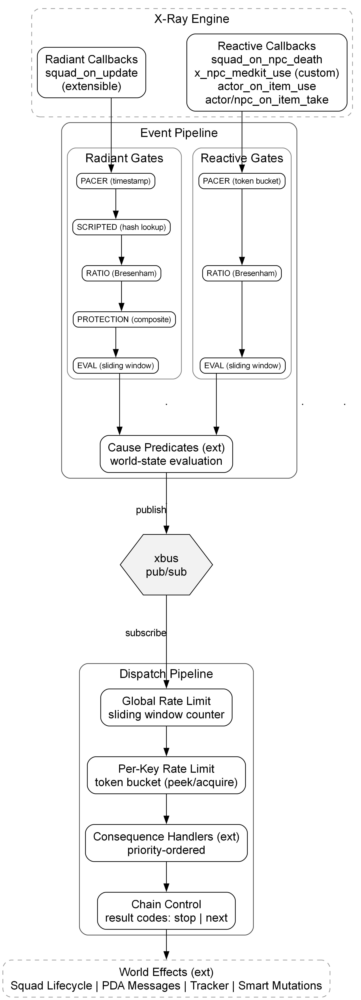
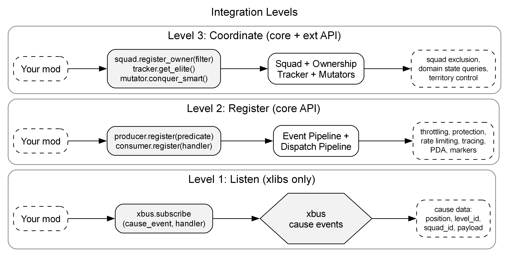

# AlifePlus Architecture

AlifePlus is a reactive framework for STALKER Anomaly. It intercepts X-Ray engine callbacks, classifies them into causes through world-state predicates, and dispatches consequences through two pipelines: an **Event Pipeline** that filters engine noise into meaningful cause events, and a **Dispatch Pipeline** that routes causes to consequence handlers. The framework owns protection, rate limiting, squad ownership, lifecycle management, and structured tracing. Domain logic registers a predicate and a handler. The framework runs the pipeline.

The architecture splits into **core** (pipeline infrastructure) and **ext** (domain logic). Core never imports ext. All domain logic reaches the framework through registered function references.

Built on xlibs. See `conventions.md` for naming rules, result codes, MCM settings, logging format.



---

## Glossary

| Term | Definition |
|------|------------|
| Cause | Engine callback + world-state predicate -> meaningful event or nil |
| Consequence | Handler subscribed to a cause; executes response logic + side effects |
| Predicate | Pure function: `(trace, ...args) -> { cause, ...payload }` or nil |
| Umbrella | Radiant cause file containing one predicate that picks among N specific causes (needs, instincts, stash, area). Never published itself; the picker emits a specific child cause (`cause:hunger`, `cause:stash_loot`, etc.) |
| Picker | Predicate logic that selects which specific child cause to publish: drive-scoring (Hull), state-classifier (stash), or priority-gate (area) |
| Drive | Hull's deprivation-driven motivation. Score = `weight * (elapsed / threshold)^2`; arrival action resets the timestamp |
| MVT | Charnov's Marginal Value Theorem (1976). Patch-foraging recovery: threshold encodes patch handling + travel time; gate is `elapsed > threshold` |
| Opportunity | Non-deprivation MVT-shaped cause (stash, area). Recovery-driven, not deprivation-driven |
| Cross-DTO read | Pattern: any predicate may read any DTO; only the owning predicate writes. Decouples read-side cause logic from write-side state ownership |
| CAUSE_CATEGORY | Behavioral axis parallel to CAUSE_TYPE. Four values: REACTIONS, NEEDS, INSTINCTS, OPPORTUNITIES. Drives rate-limit grouping, MCM organization |
| Producer | Dispatches callbacks through gate chain, pre-checks per-category rate, calls predicates, publishes to xbus |
| Consumer | Receives cause events from xbus, dispatches to consequences via round-robin |
| xbus | Pub/sub event bus (xlibs). Causes publish, consequences subscribe |
| Core | Framework modules (ap_core_*). Pipeline, lifecycle, protection, rate limiting |
| Ext | Domain modules (ap_ext_*). Causes, consequences, data, messages |

---

## System Layers

AlifePlus is split into two layers: **core** and **ext**. Core is the framework - it knows nothing about massacres, stashes, or alphas. Ext is the domain - it knows nothing about gate chains, rate limiting, or squad lifecycle. The boundary is enforced by a hard rule: **core never imports ext**. All domain logic reaches the framework through registered function references (predicates, handlers, arrival callbacks).

### Core

The pipeline, protection, squad lifecycle, rate limiting, tracing, and configuration. Any cause/consequence mod can plug into core without modifying it.

| File | Role |
|------|------|
| ap_core_producer | Gate chain, predicate evaluation, xbus publish |
| ap_core_consumer | Dispatch: xbus subscribe, consequence iteration, result codes, rate gating |
| ap_core_broker | Ownership registry, squad scripting lifecycle, activity record (FIFO), arrival detection, protection |
| ap_core_hud | PDA map markers, pipeline statistics, HUD overlay |
| ap_core_limiter | Rate limiting: cause counter, consequence token bucket, global consequence counter, cooldowns |
| ap_core_debug | Logger, observe() tracing, result helpers. Zero overhead below DEBUG |
| ap_core_utils | Event pub/sub wrappers, PDA dispatch, find_squads/find_smart with protection filters |
| ap_core_const | Enums: CALLBACK, CAUSE_TYPE, RESULT, TRACE, SQUAD_ACTION, timing constants |
| ap_core_mcm | MCM defaults, config snapshot (cfg table), UI builder |
| ap_core_compat | Save data cleanup for version upgrades, proxy ownership registrations |
| _ap_deps | Dependency gate: assert xlibs installed and version-compatible |

### Ext

Causes, consequences, domain state, messages, test tools. Ext files register with core at `on_game_start` and never touch the pipeline internals.

| File | Role |
|------|------|
| ap_ext_cause_* | Cause predicates (one file per cause group) |
| ap_ext_consequence_* | Consequence handlers (one or more files per cause) |
| ap_ext_tracker | Domain state: kill counts, alphas, stalker needs DTO |
| ap_ext_smart_mutator | Runtime smart terrain mutations (territory conquest, mutant infestation) |
| ap_ext_object_mutator | Runtime combat modifiers for alpha mutants (hit power scaling, panic immunity) and high-rank stalkers (rank-based hit power) |
| ap_ext_util | Domain gates: alignment, personality checks, FIFO-cached species resolution |
| ap_ext_const | Community sets, faction lists, item pools |
| ap_ext_news | News composer (flat per-consequence + per-cause templates, xpda dispatch) |
| ap_ext_test | In-game debug commands |

---

## Core

### Execution Model

X-Ray runs Lua on a single thread. There is no concurrency within one engine tick. When the engine fires a callback like `squad_on_update`, the entire AP pipeline executes synchronously in one Lua call stack before control returns to the engine. The producer evaluates gates, the cause predicate runs, xbus publishes, the consumer iterates all consequences, each handler runs and may script a squad. All of this completes inside a single function call.

```
engine squad_on_update
  -> producer._on_radiant (gate chain: pacer_1, is_protected, ratio, pacer_2)
    -> cause cascade: shuffle causes, try each predicate, stop on first publish
      -> cause predicate (ext) returns nil -> try next cause
      -> cause predicate (ext) returns { cause = CAUSE.X, ...payload } -> publish + break
        -> _try_publish -> xbus.publish (synchronous, inline)
          -> consumer._process (shuffle consequences, iterate)
            -> consequence handler (ext) returns { code = RESULT.X }
              -> script_squad (core) sets scripted_target, registers arrival
          <- all consequences done, returns to producer
        <- cascade breaks on first publish
```

When `_try_publish` returns, the consequences have already executed, squads have been scripted, and counters have been incremented. `xbus.publish` calls each subscriber function inline and returns when all have finished.

### Event Pipeline

The producer receives engine callbacks and filters them through a chain of gates before evaluating cause predicates. Two variants exist because radiant and reactive events have fundamentally different characteristics.

**Radiant events** are ambient observations. A squad periodically scans its surroundings and notices something (a stash, empty territory, an unmet need). The squad is both sensor and responder. High frequency, low significance per event.

**Reactive events** are world-state changes. Something happened (a death, a healing, a pickup) and the framework reacts. The triggering entity may not be the entity AP acts on. Low frequency, high significance per event.

#### Radiant variant

Radiant causes fire on `squad_on_update` - the only stable, uniform heartbeat covering both online and offline squads. The engine fires this callback from `sim_squad_scripted:update()` for every squad every tick. Online squads fire at frame rate (~3/sec per squad), offline squads fire via the A-Life scheduler round-robin (~0.03/sec per squad, ~20 squads per tick across ~776 total). This produces a raw volume of ~6,600 calls/min that the gate chain must reduce to a manageable rate.

Radiant causes are an open collection. New causes can be added by registering a predicate on `RADIANT_CALLBACKS`. Each admitted call shuffles the registered radiant causes (`xtable.shuffle`) and cascades through them in random order. The first cause whose predicate publishes stops the cascade. If all predicates reject, nothing publishes. Shuffling ensures fair distribution regardless of how many causes apply to a given squad's alignment -- no cause is systematically favored. With `distributor_interval_sec = 5s` (~12 triggers/min), every admission tries up to 4 causes (worst case). This is different from reactive causes, where all causes for a callback evaluate independently on every admitted event.

The triggering squad is both sensor and responder - it evaluates its own surroundings and acts on what it finds (stashes, empty territory, unmet needs).

**Gate 1: PACER_1.** Coarse rate limiter. Pure `os.clock()` timestamp comparison with a 100ms interval (~10 admits/sec). Runs before any squad field access. No `squad.id`, no luabind. Rejects ~98% of raw `squad_on_update` volume at near-zero cost. Instead of caching known-bad squads (old BANNED gate), PACER_1 simply limits how many squads reach the eligibility check.

**Gate 2: is_protected.** Full eligibility check via `ap_core_broker.is_protected`. Runs on ~10 squads/sec from PACER_1. Checks ownership (warfare), is_scripted (engine `scripted_target`, condlist, random_targets), permanent (story, trader, named NPC -- session-lifetime cache), active role (task giver, companion), and task target (assault, bounty, delivery). Short-circuits early: scripted and permanent squads are caught in the first two checks. Subsumes the old BANNED and SCRIPTED gates. At 10/sec, the cost is acceptable without negative caching.

Protection is not a single gate - it is applied at four layers across the pipeline. The same guard set is checked at each layer, but against different entities depending on context:

| Layer | Where | What is checked |
|-------|-------|-----------------|
| Producer | Radiant gate 2 (is_protected) | Triggering squad, before any cause evaluates |
| Cause | Reactive predicates | The entity AP would act on (killer, patient, taker) |
| Consequence | `ap_core_utils.find_squads` | Every candidate responder squad |
| Squad | `ap_core_broker.script_squad` | No inline check - protection is upstream |

Reactive causes skip the producer protection gate because the callback entity (e.g. a dead victim in `squad_on_npc_death`) is not the entity AP would script. Instead, reactive causes check protection on the relevant entity inside the predicate itself: `alpha` and `alphakill` guard the killer, `wounded` guards the patient, `harvest` guards the taker. Causes where the trigger is a dead victim (`massacre`, `squadkill`, `basekill`) need no guard - consequences find responders through `find_squads` which applies all exclusions.

`script_squad` does not check protection. It assumes all upstream layers have already verified the squad. Direct callers outside the pipeline must check `is_protected` themselves.

**Gate 3: RATIO.** Bresenham integer admission gate. Off-map events outnumber on-map ~50-100:1 per squad because online squads fire at frame rate while offline squads fire via scheduler round-robin. The ratio gate restores balance using integer cross-multiplication: `throttled_count * |r| <= (10 - |r|) * favored_count`. At the default ratio of 8, this admits ~4 on-map events per 1 off-map. The `squad.online` field (C++ `m_bOnline`, refreshed by `check_online_status()` immediately before the callback) determines on-map status with zero luabind cost. Radiant and reactive pipelines maintain separate counter pairs (`_radiant_ct`, `_reactive_ct`) so high-volume radiant traffic does not bias reactive admission. Counters reset at 32768 to prevent overflow. Must be after is_protected so it only balances eligible squads.

**Gate 4: PACER_2.** Budget limiter. `os.clock()` timestamp comparison with `cfg.distributor_interval_sec` (default 5s, ~12 triggers/min). Only fully eligible, ratio-balanced squads consume triggers. Every PACER_2 admit produces an EVAL -- zero waste. This is the key improvement over the old pipeline: the old single pacer ran before eligibility checks, so ineligible squads (scripted dogs, story NPCs) consumed triggers and starved the pipeline.

**EVAL (cascade).** Shuffles the registered cause predicates in-place inside a reusable buffer (no per-tick allocation) and cascades through them in random order. Each entry's category is checked against a per-CAUSE_CATEGORY sliding window rate limit (`cfg.cause_max_<category>`, 60s window) before the predicate runs; rate-blocked entries are skipped and the cascade continues. The first predicate to publish a specific cause stops the cascade. If all predicates reject (or are rate-blocked), nothing publishes. Predicates self-observe under their picked specific cause; producer calls them directly. On publish, xbus dispatch is synchronous: the consumer runs all consequences inline before control returns to the producer (see Execution Model). Worst case: 4 predicate evaluations per admission (0.00-0.08ms each). At 12 admissions/min = ~1ms/min extra.

#### Reactive variant

Reactive causes fire on world events: `squad_on_npc_death`, `x_npc_medkit_use`, `actor_on_item_take`, `npc_on_item_take`, `actor_on_item_use`. These are low-frequency, high-significance events (a death, a healing, a pickup). The gate chain is shorter because the triggering entity may be a dead victim or an uninvolved bystander - protection must happen downstream in causes and consequences where the actual responder is known.

**Gate 1: PACER.** Token bucket with per-callback-type keys, 1 token/sec per type. Independent from the radiant pacer.

**Gate 2: RATIO.** Same Bresenham algorithm as radiant but with its own counter pair (`_reactive_ct`). Some reactive callbacks (`actor_on_item_use`, `actor_on_item_take`) are always on-map (they require a game_object which only exists online).

**Gate 3: EVAL.** Iterates all registered reactive cause predicates for the callback type in deterministic order (indexed array). Each predicate is checked against the per-cause sliding window rate limit, then evaluated. All causes evaluate independently. A single death event can trigger MASSACRE, SQUADKILL, and ALPHA simultaneously because different responder squads act independently. Radiant cascade stops on first publish because the triggering squad can only do one thing.

#### Instrumentation

Both pipelines measure gate span and eval span. Gate span covers the time from first eligibility check to budget admission (radiant: is_protected + RATIO + PACER_2; reactive: PACER + RATIO). Eval span covers cause predicate evaluation, xbus dispatch, and all consequence handlers. Spans are accumulated per `PACER_LOG_INTERVAL` (60s) and reported as avg/max in the periodic `[PIPELINE]` dump. All timing uses `os.clock()` and is gated by `ap_core_debug.enabled()` -- zero overhead when log level is above DEBUG.

### Dispatch Pipeline

After a cause publishes to xbus, the consumer receives the event and iterates registered consequence handlers for that event type. The dispatch rules differ between radiant and reactive events.

#### Dispatch Rules

1. **Radiant cascade (producer).** The producer shuffles registered radiant cause predicates and cascades through them in random order. The first predicate to publish stops the cascade. Remaining causes do not evaluate. Shuffling ensures fair distribution across causes regardless of alignment subset.

2. **Cause publish contract.** A cause predicate must not publish if no consequence can act on the event. The cascade stops on publish -- if every consequence rejects, the trigger is wasted. Causes that serve a subset of alignments must filter at the cause level (e.g. `alignment_human` for stash/needs, `alignment_mutant` for instincts) rather than relying on consequences to reject.

3. **Per-need/per-instinct routing.** Needs and instincts causes register one predicate with the producer but publish specific xbus events per need/instinct (`cause:hunger`, `cause:heal`, `cause:instinct_scatter`, etc.). Each consequence subscribes to its specific event. Only consequences that handle the winning need/instinct receive the event. No mismatch iteration.

4. **Consequence shuffle.** The consumer shuffles consequences for each event before iterating. This distributes evaluations fairly across alternative handlers (e.g. shelter_indoor vs shelter_outdoor, stash_loot vs stash_fill).

5. **Radiant: stop on first success.** For radiant events, the consumer stops the loop after the first consequence returns `SUCCESS`. One squad, one action per trigger. Alternatives compete via shuffle -- each has equal probability of being tried first.

6. **Reactive: all run independently.** For reactive events, all consequences for the cause run regardless of results. Multiple consequences can fire from a single event (e.g. massacre_investigate and massacre_scavenge both respond to the same massacre). Different actor types respond simultaneously.

7. **Loop stop conditions.** The consequence loop stops early on: (a) radiant success (rule 5), (b) global radiant budget exhaustion (`global_consequence_max_events`). All other results (FAILED_RULES, FAILED_SCAN, FAILED_ACTION, DISABLED, rate-limited) skip to the next consequence.

#### Pre-gates and Result Codes

**Before each handler runs, the consumer checks two pre-gates.** The `condition` function (registered at init, typically checks MCM enabled flag) determines if the consequence is active. If it returns false, the consumer skips the consequence. Then the rate limiters are checked: if the per-type budget for this consequence is exhausted, the consumer skips it. If the global radiant budget is exhausted, the consumer stops the entire loop. The handler never runs when a pre-gate rejects.

**The handler runs and returns `{ code = RESULT.X, reason = "..." }`.** The result code tells the consumer which phase of the handler answered. Every consequence handler follows a three-phase structure called the consequence template (see Consequence Template below). `FAILED_RULES` means the handler checked its business rules (alignment, personality, species, validation) and rejected the event. `FAILED_SCAN` means the rules passed but a world query found nothing (find_squads returned empty, find_smart found no match, an entity lookup returned nil). `FAILED_ACTION` means the rules and eval passed but the action failed (script_squad could not route the squad, a registration call returned false). `SUCCESS` means the consequence executed its action.

**On `SUCCESS`, the consumer increments the per-type counter, increments the global radiant counter (for radiant events only), and sets `event_data._fired = true`.** For radiant events, success also stops the loop (rule 5).

### Rate Limiting

Rate limiting lives in `ap_core_limiter`. Six independent layers operate at different scopes; each answers a different question.

| Layer | Mechanism | Scope | Default | Config |
|-------|-----------|-------|---------|--------|
| Radiant pacer | os.clock timestamp | global | 5s | MCM distributor_interval_sec |
| Reactive pacer | token bucket | per-callback-type | 1/sec | constant |
| Per-squad MVT/Hull threshold | DTO last_X_at + arrival reset | per-squad per-cause | per-cause MCM | `cause_<X>_threshold` (game hours) |
| Per-category cause budget | TTL counter, sliding window | per-CAUSE_CATEGORY | 20/60s | MCM `cause_max_<category>` |
| Per-consequence budget | token bucket (peek/acquire) | per-consequence | 2/60s | MCM consequence_max_events |
| Global radiant consequence | TTL counter | radiant only | 5/60s | MCM global_consequence_max_events |

**Per-squad MVT/Hull threshold.** Owned by each cause file's predicate. Caps how often the same squad can republish the same specific cause. Reads `last_<X>_at` from a DTO (`_ap_stalker_needs`, `_ap_mutant_instincts`, or `_ap_squad_opportunities`); arrival action resets the timestamp. Hull family (needs, instincts) compares elapsed against `weight * (elapsed / threshold)^2`; MVT family (stash, area) compares elapsed directly against `cfg.cause_<X>_threshold * HOURS_TO_SECONDS`.

**Per-category cause budget.** Pre-handler check on `entry.category` inside `ap_core_producer._eval_*`. Skips the predicate entirely when the category is rate-blocked, freeing the cascade slot for the next entry. Four MCM sliders mirror `CAUSE_CATEGORY`: `cause_max_reactions`, `cause_max_needs`, `cause_max_instincts`, `cause_max_opportunities`. Each handler declares its category at register time; predicates carry no rate-limit awareness.

### Tracing

Hierarchical tracing via `observe()` (consequences, internal phases) and the prof+trace:push+debug pattern (cause predicates) in `ap_core_debug`. Each trace carries a monotonic **tid** (trace ID) and a slash-separated **path** (span hierarchy). A single `tid` links a cause through its consequence chain into individual actions:

```
[CAUSE.HUNGER] [tid=42 path=cause:hunger] sq=1337 need=hunger drive=4.2 [0.15ms]
[CONSEQUENCE.HUNGER_CAMPFIRE] [tid=42 path=cause:hunger/CONSEQUENCE.HUNGER_CAMPFIRE] success count=1 [0.83ms]
[CONSEQUENCE_PHASE.FIND_DESTINATION] [tid=42 path=cause:hunger/CONSEQUENCE.HUNGER_CAMPFIRE/CONSEQUENCE_PHASE.FIND_DESTINATION] ok id=445 [0.12ms]
```

The path root is the **specific cause** (`cause:hunger`), never an umbrella label. Predicates self-observe: they pick the winning specific cause, then build the result, then `trace:push(result.cause)` and emit a debug line under `bracket(result.cause)`. Producer no longer wraps predicates in `observe()` — predicates are pure and own their own timing.

`bracket(constant)` in `ap_core_debug` composes log labels by uppercasing and replacing `:` with `.`: `"cause:hunger" -> "[CAUSE.HUNGER]"`. Each cause/consequence file caches its bracket strings at module load (e.g. `LOG_INIT = bracket(CAUSE_CATEGORY.OPPORTUNITIES)` for the umbrella init log, `LOG_BY_CAUSE[c] = bracket(c)` for per-publish logs). No hardcoded `[CAUSE.X]` literals.

Below DEBUG log level: `observe()` is a bare passthrough (calls the function, returns the result). `trace()` returns a null singleton. `xprofiler.new_if(false)` returns a null singleton. Cost: one `enabled()` check (~150ns) per call. All null singletons are pre-allocated — no allocation at non-debug levels.

### Squad Lifecycle

`ap_core_broker` manages the full lifecycle of squads under AP control: scripting, arrival detection, post-arrival wait, and release.

**Scripting.** `script_squad(squad, smart, opts)` sets `scripted_target` via `xsquad.control_squad`. `scripted_target` routes the squad to `specific_update` (direct A->B movement). AP clears `__lock` on acquisition -- `scripted_target` alone is sufficient for routing. If another mod clears `scripted_target` between ticks, `generic_update` runs and the squad may be reassigned by SIMBOARD; `reassert_target` restores `scripted_target` within 20s. The squad is registered in `_ap_scripted_squads` with a TTL, optional arrival handler, and wait duration. `script_actor_target(squad)` scripts a squad to pursue the player using engine-native actor targeting (no arrival detection).

**Scripted squad scan.** `_update_scripted_squads` runs every 20s via `CreateTimeEvent`. For each tracked squad:

1. **Entity** - `xobject.se(squad_id)`. Gone -> remove from tracking table. Catches squads that died or despawned between scans.
2. **Reassert** - `xsquad.reassert_target(squad, data.scripted_target)`. Restores `scripted_target` if another mod overwrote it, clears `__lock`. Every alife overhaul mod (warfare, Vintar) sets these fields every tick on its own squads; AP reasserts every 20s on its squads.
3. **TTL** - 7200 game-seconds. Expired -> unscript. Prevents permanently pinned squads.
4. **Arrival** - `xsmart.is_arrived(squad, smart)`. On arrival: if smart is full and squad is online, fire the arrival handler then unscript (overflow). Otherwise, dispatch the registered `on_arrive` function, then enter wait state.
5. **Wait** - `release_at = game_sec() + pre_release_gulag` (default 300s). When game time exceeds `release_at`, unscript. Game time advances during sleep/time-skip and survives save/load.

**Save/load.** `_ap_scripted_squads` persists to `m_data.ap_core_broker`. Activity record is session-only (FIFO resets on load). Engine-side `scripted_target` persists natively across save/load (`sim_squad_scripted` STATE_Write/STATE_Read). Arrival handler functions are transient - they are re-registered every load via `consumer.register` opts. On load, squads marked as arrived get `release_at = 0` (immediate release on next scan).

**Activity record.** `record(squad_id, cause, consequence, opts)` appends an entry to a bounded FIFO (`xttltable.create_fifo_cache`, capacity 256). Each entry stores ids and event-time facts only -- display data resolves lazily at render. `_record_assigned[squad_id]` is a side index mapping each squad to its currently-assigned entry. When a new entry is recorded for the same squad, the previous entry's `assigned` flag flips to false. On FIFO eviction, the `on_evict` callback cleans up the assigned index. `get_record(opts)` returns the most-recent matching entry; `{ squad_id = X, assigned = true }` is the O(1) hot path via the index. `get_records(opts)` returns an array of all matches. `clear_record(squad_id)` is a pure entry drop (broker stays out of HUD/marker concerns; HUD owns marker lifecycle). Localized rendering uses `ap_core_const.CONSEQUENCE_INFO[consequence]` directly: each entry has `name_key` (short caption) and `action_key` (full action phrase) XML ids resolved via `game.translate_string`.

**Coordination.** `scripted_target` is the squad control field. Setting it routes the squad to `specific_update`. AP no longer sets `__lock` (clears it on acquisition). `scripted_target` alone is sufficient for routing; `__lock` was a redundant fallback guard. AP checks `scripted_target` at gate 2 (is_protected, via `xsquad.is_scripted`). Two alife mods that both check `scripted_target` before claiming a squad will not conflict. `xsquad.control_squad` sets `scripted_target` on acquire; `xsquad.release_squad` clears it on release; `xsquad.reassert_target` restores it if overwritten. The ownership registry (`register_owner`) adds identity on top: it tells AP WHO owns a squad, not just that it's owned. Warfare and BAO are registered by default in `ap_core_compat`.

### HUD (ap_core_hud)

`ap_core_hud` consolidates all visual output: the pipeline statistics overlay and PDA map markers. It reads activity data from `ap_core_broker` and owns no domain state.

**Markers.** HUD owns the marker lifecycle end-to-end via a private `_marker_state[squad_id] = { consequence, remove_at }` table. An apply pass reads `broker.get_records({ assigned = true })`, resolves the action phrase via `ap_core_const.CONSEQUENCE_INFO[entry.consequence].action_key` + `game.translate_string`, marks via `xpda.mark_squad` for any squad whose tracked consequence has changed (or has no marker yet), and updates `_marker_state`. A validate pass iterates `_marker_state` itself: for each squad without a live scripted record (entry evicted, entity died, or `scripted_target` cleared), start a linger timer; once expired, unmark and drop the slot. Entity death triggers `_on_server_entity_on_unregister`, which unmarks immediately and calls `broker.clear_record`. The broker holds no marker state.

**Statistics overlay.** Pipeline counters (`r` for radiant, `x` for reactive) track events, gate admissions, cause publishes, consequence results, and blocker breakdown. `classify(result, is_radiant)` routes each consequence result to the appropriate counter. `UIStatsHUD` renders a compact table with R/X columns and a per-minute or percentage extra column. Six screen positions via MCM. Hides on PDA, inventory, and menus. Zero overhead when `statistics_position` is "off". Log dump every 10s with total and per-minute breakdowns.

### Initialization Lifecycle

Four phases. Each requires the previous to complete.

**Phase 0: Module load.** The engine's auto-load mechanism (`_G.__index = auto_load` in `script_engine.cpp:375`) resolves `.script` files on first namespace access. `axr_main.on_game_start()` iterates all `.script` files in alphabetical order, triggering auto-load for each. Module-level code runs immediately on load: engine globals are cached to locals, constant tables are built, xlibs API references are captured. No game state exists at this point - no actor, no entities, no callbacks active.

**Phase 1: on_game_start.** `axr_main` calls `on_game_start()` on every loaded script. File order is alphabetical, but all operations are independent - no cross-module reads at this phase:

- `_ap_deps` asserts xlibs compatibility. Hard crash on mismatch.
- `ap_core_mcm` loads config from defaults, registers `on_option_change`.
- `ap_core_debug` registers `actor_on_first_update` for deferred log level init.
- `ap_core_producer` resets dispatch state, registers `actor_on_first_update`. Does NOT subscribe to callbacks yet.
- `ap_core_consumer` registers `actor_on_first_update`. Does NOT subscribe to xbus yet.
- `ap_core_broker` registers save/load callbacks, creates the 20s scripted squad scan timer.
- `ap_core_hud` resets statistics, registers first_update/option_change/net_destroy/GUI/entity_unregister callbacks.
- `ap_core_compat` registers `load_state` for save cleanup, registers ownership proxy (warfare).
- `ap_ext_cause_*` register predicates with producer via `register()`.
- `ap_ext_consequence_*` register handlers with consumer via `register()`. Arrival handlers registered via consumer opts.

After phase 1: all predicates and handlers are registered, but no callbacks are subscribed and no xbus subscriptions are active. The deferred init pattern avoids alphabetical ordering bugs - `ap_core_producer` (alphabetically before cause files) cannot build its radiant handler set until all causes have registered, so it defers to `actor_on_first_update`.

**Phase 2: actor_on_first_update.** Game world and actor exist. Deferred initialization runs:

- Producer rebuilds the radiant handler set from all registrations, subscribes to engine callbacks.
- Consumer subscribes to xbus cause events.
- Debug reads MCM log level (config is now loaded), dumps all MCM settings at DEBUG.
- HUD clears stale map markers from previous session, starts marker timer if MCM `map_markers` is enabled. Activates statistics overlay if MCM `statistics_position` is not "off".

The `actor_on_first_update` callback fires on the first frame with a live actor. It fires on every level transition (not just game start), so all handlers use a `_subscribed` guard to prevent duplicate registration. Named function references registered via `RegisterScriptCallback` are naturally deduplicated (the function reference is the table key), but the guard prevents redundant work.

**Phase 3: on_game_load.** Fires after `STATE_Read` rebuilds all server entities from the save file. At this point `alife_object(id)` works and entity mutation is safe. The smart mutator re-applies conquered smart terrain data from `_conquered_pending` (two-phase restore: `load_state` reads the data, `on_game_load` applies the mutations, because `load_state` fires before entities exist).

Critical timing from the engine load sequence:
1. `load_state` - save data read (`m_data` available), entities do NOT exist yet
2. `STATE_Read` - engine deserializes all server entities, rebuilds smart terrain config from LTX
3. `on_game_load` - entities exist, mutations can be applied

---

## Ext

### Tracker (ap_ext_tracker)

Domain state manager. Tracks kill counts per entity (`_ap_killers`), alpha status with level/kills/name (`_ap_alphas`), alpha death grace period (`_ap_alpha_dead`, xttltable TTL, 3600s), stalker needs DTO (`_ap_stalker_needs`, per-squad timestamps for 9 Hull drives), mutant instincts DTO (`_ap_mutant_instincts`, 5 Hull drives), and squad opportunities DTO (`_ap_squad_opportunities`, MVT timestamps for stash and area causes — single shared table since squad_id is unique across stalker/mutant). Only mutants become alphas. Stalker rank is handled natively by the engine. Registers the `squad_on_npc_death` handler for kill/alpha tracking. Save/load to `m_data.ap_ext_tracker`.

DTOs hold primitive timestamps. Multiple predicates may derive different conclusions from the same DTO (Cross-DTO read pattern); only the owning predicate writes. Example: `_ap_stalker_needs` is written by the needs predicate on arrival reset; future area_abandon predicate reads it to count overdue fields without writing.

### Smart Mutator (ap_ext_smart_mutator)

Runtime smart terrain mutations for territory conquest and mutant infestation.

#### Engine respawn mechanism

The engine has two respawn pathways for smart terrains (src: smart_terrain.script:246-304, 1657-1700):

**Pathway 1: LTX respawn_params (~460 smarts).** Most smarts define spawn sections in LTX (e.g. `spawn_stalker@advanced` with `spawn_squads = stalker_sim_squad_novice`). These entries have NO `.faction` field. The respawn filter at line 1667 passes via `self.faction_controlled == nil` -- ALL params fire regardless of who occupies the smart. This is the natural population baseline: a Cordon smart configured to spawn loners will always spawn loners. Only 14 of ~490 smarts have `default_faction` in LTX; for the rest it is nil. The LTX spawn tables ARE the ground truth for what "belongs" at each smart.

**Pathway 2: faction_controlled (~16 vanilla smarts).** Smarts with `faction_controlled` in LTX generate `respawn_params` entries with a `.faction` field for each listed faction. The respawn filter at line 1667 gates spawning: `if v.faction == self.faction` -- only the faction matching `self.faction` spawns. Changing `self.faction` (via NPC presence or runtime mutation) switches which faction respawns. This is the engine's designed mechanism for dynamic territory control (src: smart_terrain.script:246-267).

**Faction resolution.** `check_smart_faction` (src: smart_terrain.script:1209-1236) runs every update tick for ONLINE smarts. It counts `IsStalker` NPCs present and sets `self.faction` to the present faction. When empty: `self.faction = self.default_faction` (nil for most smarts). Monsters (`IsMonster`) are invisible to this function -- a smart occupied only by mutants reverts its faction as if empty. `check_smart_faction` runs AFTER `try_respawn` in the update cycle (line 1279 vs 1253), and only for online smarts.

#### How AP uses the respawn mechanism

**Mechanism (shared spawn).** `conquer_smart(smart_id, faction)` calls `xsmart.set_shared_spawn(smart, "ap_conquest", faction, spawn_num)`, which adds ONE `respawn_params` entry for the conqueror's faction. The entry has no `.faction` field and `faction_controlled` is NOT set. Because `faction_controlled` remains nil, the engine's respawn filter at line 1667 passes ALL entries unconditionally -- both the original LTX entries and the injected conquest entry fire. The conqueror's squads appear alongside the originals, competing for `max_population` slots. Squad sections come from `xsmart.SQUADS_BY_FACTION`: stalker factions spawn `*_sim_squad_novice/advanced/veteran`, mutant factions spawn `simulation_*` sections.

**Coexistence.** On a `max_population=1` mutant lair, the conquest entry competes with the original mutant entry. The engine picks one eligible entry at random per respawn cycle (src: smart_terrain.script:1707). Result: sometimes a mutant spawns, sometimes the conqueror's squad. On a `max_population=3` stalker camp, the conqueror adds one squad slot alongside existing stalker spawns. Mixed presence, not replacement.

**Revert.** `xsmart.clear_shared_spawn(smart, "ap_conquest")` removes the entry from `respawn_params`. The smart returns to its original LTX-only spawn tables. No other fields to undo -- `faction_controlled` and `smart.faction` were never modified.

**Volatility.** The engine rebuilds `respawn_params` from LTX on every load (`STATE_Read` calls `read_params`), so the injected entry is lost. The mutator uses two-phase restore: `load_state` reads conquered smart data to `_conquered_pending`, `on_game_load` re-applies via `set_shared_spawn` after entities exist. A 60s periodic scanner also re-applies injections as a safety net. Load order: `load_state` (data only) -> `STATE_Read` (entities created, `read_params` rebuilds from LTX) -> `on_game_load` (safe to inject).

**Decay.** Conquered smarts lose the conqueror's spawns after `cfg.area_conquest_decay_hours` game hours (default 72). The scanner checks `xtime.game_sec() - conquered_at` and calls `clear_shared_spawn` on expired entries. The original LTX spawns were never interrupted -- decay just removes the extra entry.

**Eviction.** FIFO at `cfg.area_conquest_max_smarts` (default 50). Oldest conquest by game time is evicted when the cap is reached. Same-faction re-conquest refreshes the timestamp (LRU). Different-faction overwrites without eviction.

#### How AP uses infestation

**Mechanism (exclusive spawn).** `infest_smart(smart_id, faction, level_id)` calls `xsmart.set_exclusive_spawn(smart, "ap_infest", faction, spawn_num)`. This sets `smart.faction_controlled` to a non-nil value (activating the engine's faction gate at line 1667) and adds ONE `respawn_params` entry with a `.faction` field matching the infesting faction. LTX entries have no `.faction` field, so they fail the gate (`nil == faction` is false) and are suppressed. Only the infest entry spawns. The effect is exclusive replacement without deleting original entries.

**Faction re-apply.** `check_smart_faction` runs every tick on online smarts and counts only `IsStalker` NPCs -- monsters are invisible. When only mutants occupy an online smart, `self.faction` reverts to `default_faction`, breaking the faction gate match. A 60s periodic scanner re-applies `smart.faction` via `set_exclusive_spawn` for all infested smarts.

**Per-level cap.** `can_infest_on_level(level_id)` counts infested smarts with matching `level_id`. Rejects if count >= `cfg.infest_max_per_level` (default 1, MCM 1-5).

**Volatility.** Same as conquest: engine rebuilds `faction_controlled`, `faction`, and `respawn_params` from LTX on every load. Two-phase restore re-applies all three in `_on_game_load`. The 60s scanner handles ongoing faction reversion for online smarts.

**Decay.** Separate from conquest. `cfg.infest_decay_hours` (default 0 = permanent). `clear_exclusive_spawn` reverts `faction_controlled` to nil, `faction` to `default_faction`, and removes the infest entry. Original LTX spawns resume on next `try_respawn`.

**Interaction with conquest.** If a smart is both conquered and infested, the exclusive spawn's faction gate suppresses the conquest entry (no `.faction` field). Infest wins at runtime. Both data tables coexist independently -- clearing infest restores conquest if it hasn't decayed.

### Object Mutator (ap_ext_object_mutator)

Runtime combat modifiers for alpha mutants and high-rank stalkers. Two independent systems on `monster_on_before_hit` and `npc_on_before_hit`.

**Alpha mutants** (`monster_on_before_hit`): outgoing hit power bonus and incoming hit power absorption via `_alpha_hit_power_dealt[npc_id]` / `_alpha_hit_power_taken[npc_id]` hash tables, populated at promote time. Panic immunity (`set_custom_panic_threshold(0)`) applied lazily on first hit. O(1) lookup, 0.5s throttle, early exit when tables empty. Alpha level: `min(10, floor(kills / alpha_kills_per_level))`. Loot items injected via `monster_on_loot_init` callback with per-species bonus pools, managed in `ap_ext_tracker`.

**Stalker rank** (`npc_on_before_hit`): outgoing hit power bonus and incoming hit power reduction for veteran+ stalkers (rank 12000+). Linear scaling from veteran to legend. Reads engine `character_rank()`, never manipulates it.

### News Composer (ap_ext_news)

Transforms AP event telemetry into stalker radio chatter via flat per-consequence and per-pair templates in `ui_st_ap_news.xml`. The composer substitutes slot values into chosen templates. There is no grammar engine. It is a presentation layer with one-way dataflow: pipeline emits, news consumes, and news never writes back to pipeline state.

**Pipeline.** Consequence SUCCESS calls `record_event(subject_squad, cause, consequence, opts)`. The function writes the subject and (optional) other squad ids, the smart and level ids, the event-time game hour, and eagerly captures squad-derived display facts for both sides: faction key + localized faction display, commander name, species + localized species plural. Smart and level remain lazy (their ids are session-stable; resolution at compose time is one extra `xobject.se` per tick). The composer tick fires on an MCM-randomized interval (slider 1-600s, defaults 30-100s). Each tick collects all unreported entries on the player's current level whose age is within `news_max_age_game_hours`, picks one **at random** (gossip, not sequential log), picks a template, substitutes slots, picks a speaker, and routes through `dynamic_news_manager:PushToChannel` (or `xpda.send` during the cold-start window).

**Record schema (broker FIFO).** `ap_core_broker.record` stores IDs + event-time facts only. Fields per entry:

| Field | Source | Notes |
|---|---|---|
| `squad_id` | first arg (subject) | actor of the consequence |
| `other_squad_id` | `opts.other_squad.id` | opposing party in two-party events; nil for single-actor |
| `cause` | second arg | CAUSE enum string |
| `consequence` | third arg | CONSEQUENCE enum string |
| `cons_id` | broker-assigned monotonic seq | returned from `record()`; used as dedup key |
| `cause_id` | `opts.cause_id` | shared by every consequence from one cause publish; groups composite siblings |
| `smart_id` | `opts.smart.id` | acting location; resolved to display name at compose |
| `level_id` | `opts.level_id` | resolved to display name at compose |
| `game_hours` | `xtime.game_sec() / 3600` | single event-time snapshot |
| `subject_faction` | `subject_squad.player_id` at record time | engine faction key (e.g. `"stalker"`, `"monster_predatory_day"`) |
| `subject_faction_display` | `_faction_display(subject_faction)` at record time | localized string (`"Loners"`, `"predators"`); feeds `#subject_faction#` slot |
| `subject_name` | `xsquad.get_commander_name(subject_squad)` at record time | commander's character name; nil for empty / mutant / unbound squads |
| `subject_species` | `xcreature.get_mutant_species(subject_squad)` at record time | xcreature species (`"bloodsucker"`); nil for stalker squads |
| `subject_species_display` | `_species_display(subject_species)` at record time | localized plural (`"bloodsuckers"`); nil if species not in `SPECIES_DISPLAY_KEY` |
| `other_*` (5 fields) | same five resolved from `opts.other_squad` if present | all nil for single-actor consequences |
| `assigned` | broker-managed | true while this is the squad's current entry; flips to false on supersede or clear |

State is session-lifetime. FIFO resets on load. News flags live in `ap_ext_news` ring buffers, never on entries.

**Role mapping.** Two-party consequences assign semantic meaning to `other_squad_id` from the per-consequence role. Single-actor consequences leave it nil. The consequence enum tells the reader what the role is.

| Consequence | subject | other |
|---|---|---|
| massacre_investigate | responding same-faction squad | killer |
| massacre_scavenge | mutant scavenger | victim squad |
| squadkill_revenge | avenger (same-faction) | killer (chased) |
| squadkill_flee | survivor (same-faction) | killer |
| basekill_support / basekill_flee | reinforcement / evacuator | attacker |
| alphakill_targeted | pursuing same-species mutant | killer (chased) |
| wounded_hunt | mutant predator | bleeder |
| wounded_help | same-faction medic squad | bleeder |
| harvest_rob | outlaw pursuer | taker (chased) |
| harvest_haunt | aberrant mutant | taker |
| alpha_promote / area_conquer / stash_* / needs_* / instincts_* | the acting squad | nil |

**Template pools.** Two pools per locale, all loaded by `_load_pool` walking `prefix_001..prefix_NNN` until miss or empty:

| Pool | Prefix | When it fires |
|---|---|---|
| Per-consequence | `st_ap_news_tpl_<consequence>_NNN` | default — focal entry alone |
| Pair-composite | `st_ap_news_tpl_cause_<cause>_pair_<a>_<b>_NNN` | both reactive sibling consequences of one cause publish are present |

The composer picks an entry and tries pair first (when `sib_count >= 2` and both pair members are present), falling back to per-consequence. Only the five reactive pair causes (MASSACRE, SQUADKILL, BASEKILL, WOUNDED, HARVEST) can accumulate siblings sharing a `cause_id` — radiant causes are one-consequence-per-cause by invariant 7. The pair pool is the only multi-sibling path: when both halves of a pair fire, pair always wins; when only one fires, sib_count=1 and per-consequence fires.

**Slots.** Every template uses some subset of these slots, populated per compose tick by `_slots_for(entry_a, entry_b, count_n)`. Squad-side values come pre-resolved from the entry (eager capture at record_event); smart and level resolve lazily at compose. Pair-composite templates use `_a` / `_b` suffixed variants of the subject slots:

| Slot | Source (at compose time) |
|---|---|
| `#subject_faction#` | `entry.subject_faction_display` (resolved at record_event) |
| `#subject_name#` | `entry.subject_name` (resolved at record_event) |
| `#subject_species#` | `entry.subject_species_display` (resolved at record_event) |
| `#other_faction#` | `entry.other_faction_display` (resolved at record_event) |
| `#other_name#` | `entry.other_name` (resolved at record_event) |
| `#other_species#` | `entry.other_species_display` (resolved at record_event) |
| `#location#` | `xlevel.get_smart_display_name(xobject.se(smart_id))` (lazy; smarts session-stable) |
| `#level#` | `xlevel.get_level_name(level_id)` (lazy) |
| `#ago#` | hours-since `game_hours`: empty (recent), `_ago_recent`, or `_ago_hours` |
| `#count#` | sibling count word, resolved from `NEWS_COUNT_KEY` table (`two`, `three`, `four`, `five`, `many`) |
| `#subject_faction_a#` / `#subject_faction_b#` | pair-composite: the two siblings' factions (a/b in alphabetical consequence order) |
| `#subject_name_a#` / `#subject_name_b#` | pair-composite: the two siblings' commander names |
| `#subject_species_a#` / `#subject_species_b#` | pair-composite: the two siblings' species displays |

`_filter_variants` drops variants whose required slot is empty before the random pick. If the filter empties the pool, the full pool is used and unfilled slots substitute to empty string. `_clean_output` then trims, collapses double spaces, and removes orphan punctuation.

**Slot density principle.** Templates are written info-first: every variant carries the slots a player or NPC would use to make a decision (where, when, who, what threat). `#location#` and `#ago#` run near-100% across all pools. `#subject_faction#` or `#subject_species#` always names the actor by role mapping. Two-party events always carry `#other_faction#`. Names (`#subject_name#`, `#subject_name_a#`, `#subject_name_b#`) are reserved for the longer narrative variants in pair pools (the squad leading a response or pursuit). Per-consequence templates carry no names: a single event has no character to anchor.

**Content lives in XML.** Both locales ship together: `configs/text/eng/ui_st_ap_news.xml` and `configs/text/rus/ui_st_ap_news.xml`. Each carries 263 ids — 180 per-consequence templates, 50 pair-composite templates, 6 mutant faction display plurals, 20 species display plurals, 2 ago strings, 5 count words. Locale is detected per tick from `system.ltx` `string_table.language`. Template pools rebuild on language change. Validator enforces id-set parity between the two locales.

**Dedup.** Single ring: `_reported_cons_ids` (xttltable fifo_cache, capacity 512). Each cons_id is dispatched at most once. The broker FIFO is capacity 256, so entries get evicted from the broker before they can fall out of dedup — no entry ever re-fires. Pair dispatch marks both siblings in one shot; per-consequence marks only the focal. Diversity comes from the random pick across the age window, not from a short-term cooldown ring.

**Speaker selection.** `_pick_speaker` iterates `db.OnlineStalkers` once per tick and filters by:

1. alive, hydrated game_object, IsStalker, not story NPC, not in combat (`:best_enemy()`)
2. **canon channel restriction** — `dynamic_news_manager.channel_status[community]` must be true. For player's faction, this gates Monolith/Army/Greh/ISG to members only (matches every other A/S-tier news mod).
3. **scope filter** — `news_scope` MCM enum. `own`: speaker community equals actor's. `allies`: speaker community equals actor's OR `is_factions_friends(actor, speaker)`. `world`: any non-enemy.
4. alignment_human (humans only; mutants never speak)

A random NPC is sampled from the filtered pool. The speaker's community becomes the channel: `PushToChannel(speaker:character_community(), { Mg, Se, Ic, Snd="news", It="npc" })`. There is no `npc:see` call (heavy, irrelevant for old gossip), no proximity cascade (events are pre-filtered to the current level so the entire `db.OnlineStalkers` set is on-event-level by definition), no faction routing by subject — the speaker IS the channel.

**Cold-start fallback.** When `dynamic_news_manager.get_dynamic_news()` returns nil (~27s window after game load), `_dispatch` falls back to `xpda.send` (direct `give_game_news`). This is the documented exception in `library/modding/anti-patterns.md` — the canonical pattern, not the bypass anti-pattern.

**MCM surface.** `news_enabled` (bool master toggle), `news_interval_min_sec` and `news_interval_max_sec` (int sliders 1-600), `news_scope` (enum: `own` / `allies` / `world`, default `allies`), `news_max_age_game_hours` (int slider 1-72, default 12). The composer randomizes the next delay between min/max bounds after every tick.

**Trace codes** in `ap_core_const.TRACE`: `NONE` (disabled or no entries), `NO_TEMPLATES`, `NO_MSG`, `NO_SENDER`, `SENT`.

**Constants in `ap_ext_const`.**

- `MUTANT_FACTION_DISPLAY_KEY`: engine mutant faction string mapped to its localized XML display id ("predators", "night predators", etc.).
- `SPECIES_DISPLAY_KEY`: xcreature species string mapped to its localized XML display id ("bloodsuckers", "chimeras", etc.).
- `NEWS_COUNT_KEY`: sibling count → XML id map for the `#count#` slot.

**Invariants.**

- Squad-derived display facts (faction key + display, commander name, species + display) are captured eagerly at record time. Smart/level/time stay lazy. Death-resilience: dead or unregistered squads remain renderable from stored strings.
- Smart and level display resolve lazily at compose via `xobject.se` + xlibs resolvers (smarts and levels have stable ids and never go invalid mid-session).
- State is session-lifetime. FIFO resets on load, dedup ring resets, template pools rebuild.
- Empty slots are nil-safe. Either the variant filter rejects the variant, or the slot substitutes to empty string and `_clean_output` collapses the gap.
- Broker storage holds event facts AND eagerly-captured squad display strings. News-only state (dedup ring, template pools) lives in `ap_ext_news` module locals.
- Channel routing is speaker-driven: speaker's community = channel. No subject-faction channel mapping, no per-consequence routing rules. Canon Monolith/Army/Greh/ISG member-only restrictions are enforced naturally because `channel_status` filters speaker eligibility.
- Events are pre-filtered to `level.current()` before random pick. Speaker pool is then `db.OnlineStalkers` (overwhelmingly the player's level by definition of "online"). No explicit speaker-level check is needed.
- Templates are immutable. The per-tick slot table builds fresh and is discarded after one substitution.
- `cons_id` is broker-assigned. News passes no monotonic counter through `opts`.
- `record_event` resolves squad-side display strings eagerly via `xsquad.get_commander_name`, `xcreature.get_mutant_species`, and `game.translate_string` (~6-12 luabind + 4 translate_string per call). Smart and level resolve at compose.
- Locale switches mid-session leave the FIFO holding strings in the previous locale until natural churn (~10-50 min at typical record rates). Pragmatic accept: switches are rare, no crash, self-resolving.
- The pair pool requires `sib_count >= 2`, structurally only reachable for the 5 reactive paired causes (massacre, squadkill, basekill, wounded, harvest). Radiant causes are 1:1 by invariant 7; ALPHA/ALPHAKILL each have a single consequence.

### Causes

> **STALE — DO NOT USE.** This table uses pre-rename names and is now superseded by `doc/features.html`. Per todo n143 (NAMING_LOCK + FIND_IN_CAUSE), the cause names below have changed (e.g. SQUADKILL → squad_kill, fear → overpowered, etc.) and the find-in-cause architecture supersedes the "no find" annotation on Needs/Instincts. Deletion deferred to the n141/n142 implementation pass; reader: trust features.html, not this table.

| Cause | Type | Callback(s) | Conditions |
|-------|------|-------------|------------|
| MASSACRE | reactive | squad_on_npc_death | alignment_human, at smart, not is_base, kill_count >= threshold |
| SQUADKILL | reactive | squad_on_npc_death | alignment_human (victim), last member dead, not is_base |
| BASEKILL | reactive | squad_on_npc_death | alignment_human, at is_base, kill_count >= threshold |
| ALPHA | reactive | squad_on_npc_death | killer is mutant, not protected, projected kills cross new level |
| ALPHAKILL | reactive | squad_on_npc_death | victim is alpha, killer not protected, cooldown clear |
| WOUNDED | reactive | x_npc_medkit_use, actor_on_item_use | subject not protected, not is_base |
| HARVEST | reactive | actor_on_item_take, npc_on_item_take | IsArtefact(item), NPC taker not protected |
| STASH | radiant | squad_on_update | not protected, alignment_human |
| AREA | radiant | squad_on_update | not protected, alignment_area (human+mutant minus ecolog/stalker/renegade). Priority-gate picker: mutant squads check infest first (territorial claim), fall through to conquer; humans check conquer only. Publishes cause:area_conquer or cause:area_infest. |
| NEEDS | radiant | squad_on_update | not protected, alignment_human, level.present(), Hull drive scoring. Publishes per-need event (cause:hunger, cause:heal, etc.) |
| INSTINCTS | radiant | squad_on_update | not protected, alignment_mutant, species resolved, Hull drive scoring. Publishes per-instinct event (cause:instinct_scatter, cause:instinct_feed, cause:instinct_sleep, cause:instinct_explore, cause:instinct_socialize) |

Predicate contract: `function(trace, ...callback_args) -> { cause = CAUSE.X, ...payload } | nil`. Producer pre-checks the per-category rate limit on `entry.category` and calls the predicate directly (no `observe()` wrapping). On success, producer attaches `._trace`, publishes `result.cause` to xbus, and increments the per-category counter. Predicates self-observe: prof+trace:push+debug under the picked specific cause, never an umbrella label. Predicates are pure — no rate-limit awareness, no counter manipulation, no side effects beyond the published payload.

#### Cause Classification

Four categories, each with its own mechanic for when and how the cause fires:

| Category | Mechanic | Cause | Consequence |
|---|---|---|---|
| Reactions | engine event (death, pickup, healing) | builds payload from callback | perception scan from event position |
| Opportunities | squad tick + look-around | `find_*` + state-classify + pick | act using payload |
| Needs | squad tick + Hull score on stalker DTO | pick strongest drive | find satisfaction location + act |
| Instincts | squad tick + Hull score on mutant DTO | pick strongest drive | find satisfaction location + act |

Reactions are simple-mechanism (the engine callback IS the event). Opportunities, Needs, and Instincts are radiant-mechanism (the squad tick is a heartbeat — only what the squad finds, scores, or picks IS the event).

##### Where finds live: 1 → N expansion

The find lives where 1 expands to N candidates.

- Reactions: 1 event → N witnesses → **consequence** `find_squads`
- Opportunities: 1 squad → N world things → **cause** `find_*`
- Needs / Instincts: 1 squad → N drives → cause picks (no find — internal score); **consequence** `find_smart` per its filter

When 1 → N is over world entities, use `find_*`. When 1 → N is over internal state, no find.

##### Cause vs consequence

| Cause owns | Consequence owns |
|---|---|
| trigger (DTO score, look-around, callback event) | probabilistic gates (personality, chance) |
| sub-cause pick (world classify, Hull score, or squad invariants) | the action |
| invariant filtering (alignment, species) | |

Cause filters by **squad invariants** — alignment, species. Properties baked in at squad creation that don't change at runtime. Valid for family pre-filter and sub-cause picking. Consequence handles **probabilistic gates** (personality roll, chance) and the action.

##### Cause-consequence cardinality (HARD RULE)

**Radiant causes are 1:1 with consequences. Always. No exceptions.**
**Reactive causes can be 1:N with consequences.**

Reason: reactive cascades pull N actors (witnesses) from one event. Each witness can react differently — different alignment, different personality — so multiple consequences make sense. Radiant pushes one actor (the ticking squad) per tick; that squad can only do one thing at a time.

Consequence: when a radiant umbrella has multiple "consequences" today (e.g. need_shelter → shelter_indoor + shelter_outdoor), it must be restructured. Either:
- The umbrella picks ONE specific cause per tick (variant pick by personality/alignment inside the umbrella predicate, publishes one of N specific causes), with each specific cause 1:1 with its consequence.
- Or the variants collapse into a single consequence with cascade-find inside the cause (try filter A, fall back to filter B, publish once).

Never publish a radiant cause that fan-outs to multiple consequence handlers.

##### Bundling rule

One predicate per shared computation with mutually-exclusive sub-cause output.

**Required for bundling (both must hold):**

1. **Shared computation.** Sub-causes derive from the same input scan or score.
2. **One emit per call.** Picker emits exactly one sub-cause; precedence resolves overlap when needed.

If either fails → separate predicates, cascade orchestrates.

| Pattern | Bundle? |
|---|---|
| Loop scoring N drives, picks strongest | yes — single loop, single winner |
| Independent scans with different filters | no — different finds, separate predicates |
| Independent engine callbacks | no — different trigger sources, separate predicates |

#### Theoretical Foundations

Radiant causes split by what the threshold MEANS, not by how it is implemented. Both shapes use the same architectural pattern — DTO timestamp + threshold gate + arrival reset — but they encode different theories.

**Hull's Drive Reduction Theory (1943).** Behavior is driven by deprivation of a biological need. The longer the deprivation, the stronger the drive. Score formula: `drive = weight * (elapsed / threshold)^2`. Squared exponent makes overdue drives compete strongly against marginal ones. Used by NEEDS (9 stalker drives) and INSTINCTS (5 mutant drives). Threshold encodes how long the squad can tolerate the deprivation before the drive becomes urgent. Arrival action satisfies the need and resets the timestamp.

**Charnov's Marginal Value Theorem (1976), Optimal Foraging Theory.** A forager exploits a patch, moves on, and the patch recovers before the next visit becomes worthwhile. Gate is binary: `elapsed > threshold`. No drive scoring; the squad either revisits the patch or doesn't. Used by stash (loot, ambush, fill) and area (conquer, infest). Threshold encodes patch handling time + travel time + recovery time between visits. Arrival action resets the timestamp.

DTO + timestamp + arrival-reset is the architectural shape both theories share. They differ in what the threshold MEANS, not how it is implemented.

### Consequences

> **STALE — DO NOT USE.** This table uses pre-rename consequence names (squadkill_revenge, area_conquer_human, instincts_scatter, etc.) and is superseded by `doc/features.html`. Per todo n143 (NAMING_LOCK + FIND_IN_CAUSE), every consequence below has been renamed under the locked pattern. Deletion deferred to the n141/n142 implementation pass; reader: trust features.html, not this table.

| Cause | Consequence | Actor | Effect |
|-------|-------------|-------|--------|
| MASSACRE | massacre_investigate | stalker | victim faction investigates |
| MASSACRE | massacre_scavenge | mutant | cowardly mutants converge on massacre site |
| SQUADKILL | squadkill_revenge | stalker | victim faction pursues killer (chase) |
| SQUADKILL | squadkill_flee | stalker | victim faction retreats to base |
| BASEKILL | basekill_support | stalker | friendly squads reinforce attacked base |
| BASEKILL | basekill_flee | stalker | squads at base evacuate |
| ALPHA | alpha_promote | mutant | update alpha level, apply hit power/panic buffs, grant loot |
| ALPHAKILL | alphakill_targeted | mutant | same-species mutants on same level pursue killer (chase) |
| WOUNDED | wounded_hunt | mutant | predator+aberrant mutants close in |
| WOUNDED | wounded_help | stalker | same-faction squads rush to help |
| HARVEST | harvest_rob | stalker | outlaws pursue artefact taker (chase) |
| HARVEST | harvest_haunt | mutant | aberrant mutants converge on pickup site |
| STASH | stash_loot | stalker | loot stash to NPC inventory (CONFIGS-driven) |
| STASH | stash_ambush | stalker | camp at stash, passive (CONFIGS-driven) |
| STASH | stash_fill | stalker | fill stash with items (CONFIGS-driven) |
| AREA | area_conquer | both | claim empty smart terrain (stalkers and mutants, decays after 48h, _set file) |
| AREA | area_infest | mutant (feral+predator+aberrant) | claim smart terrain as nest with exclusive spawn injection. Cowardly excluded (too weak). Per-level cap. (_set file) |
| NEEDS | (14 entries) | stalker | hunger, sleep, rest, heal, shelter, money, supply, job, social (CONFIGS factory) |
| INSTINCTS | instincts_scatter | mutant (cowardly+feral+predator) | scatter from higher-tier predators to safe smart terrain. Food chain: tier 0 fears 1+2+3, tier 1 fears 2+3, tier 2 fears 3. |
| INSTINCTS | instincts_feed | mutant (all) | move to territory to hunt/scavenge |
| INSTINCTS | instincts_sleep | mutant (all) | return to species-appropriate rest location (cowardly->territory, feral->lair, predator->lair/surge, aberrant->surge) |
| INSTINCTS | instincts_explore | mutant (cowardly+feral+predator) | wander to nearby territory or lair. Aberrant excluded (lair-bound). |
| INSTINCTS | instincts_socialize | mutant (cowardly+feral) | move toward smart with same-faction squads. Predator and aberrant excluded (solitary). |

Handler contract: `function(event_data) -> { code = RESULT.X, reason = "..." }`. All domain gates (alignment, species, personality) live in ext consequence code, never in core. Dispatch order: round-robin cursor per cause type.

### Consequence Template

Every consequence handler follows a fixed three-phase structure (Template Method):

```
rules -> eval -> action
```

| Phase | What runs | Returns on fail |
|-------|-----------|-----------------|
| rules | alignment, species (direct hash), personality, match (need/instinct), validation (nil args, at_base) | `FAILED_RULES` |
| eval | find_squads, find_smart, xobject.se (entity lookup) | `FAILED_SCAN` |
| action | script_squad, script_actor_target, update_alpha, conquer_smart | `FAILED_ACTION` |
| action (ok) | | `SUCCESS` |

Each phase runs in order. If a phase fails, the handler returns immediately with the corresponding result code. The handler never reaches a later phase if an earlier phase failed.

Gate order within the rules phase: alignment -> species (direct hash on resolved identity) -> personality -> match -> validation.

### Domain Gates

Alignment and personality are domain-level gates. They live exclusively in ext consequence code (`ap_ext_util`), never in core. Core knows nothing about factions, species, or personality traits. Species filtering is a direct hash lookup on the resolved identity, not a separate function.

**Gate order inside every consequence handler:**

1. **Alignment** (hard filter, deterministic). Can this faction participate at all? Static hash set lookup on engine faction (`squad.player_id`), O(1). Checked via `ap_ext_util.check_alignment`.
2. **Species** (hard filter, deterministic). For mutants: is this the right kind of mutant? Species is resolved once via `ap_ext_util.get_species` (FIFO-cached, 0 luabind on hit). Stalkers have nil species and pass automatically. Mutants are checked via direct hash lookup on the species alignment set.
3. **Personality** (probability, non-deterministic). How likely is this faction/species to act? Averages relevant traits (max 2 per consequence), clamps to MCM `personality_min`/`personality_max` (defaults 0.20/0.70), rolls. INV_ traits resolve as `1 - base_value` before averaging. Checked via `ap_ext_util.check_personality`. The identity key (species for mutants, community for stalkers) is resolved once and shared with the species gate.

Not every consequence uses all three gates. Human-only consequences skip species. Some consequences (alpha_promote) have no gates beyond enabled check. But when gates are present, the order is always alignment -> species -> personality.

**Where gates apply depends on cause type:**

- **Radiant:** the ticking squad is both sensor and responder. Gates check `event_data.community` (the squad's faction) and `event_data.squad_id` (for species).
- **Reactive, same-faction:** gates check the event faction (victim faction, wounded faction). Responders are found via `find_squads` with that faction.
- **Reactive, cross-faction:** the alignment set IS the `factions` parameter to `find_squads`. Species and personality are checked per-squad on the found candidates, inside the find loop.

### Alignment

Hard filter: can this faction do this consequence at all. Static hash sets in `ap_ext_const`, O(1) per check. Zombied is excluded from alignment_human and therefore from all human consequences globally.

Human factions follow GSC's moral axis (Ai.doc:65-76, тип характера):

| Table | Factions | GSC origin |
|-------|----------|------------|
| alignment_principled | dolg, army, monolith, isg | Principled: follows rules, organized |
| alignment_selfserving | stalker, csky, ecolog, freedom, killer | Self-serving: independent, own goals |
| alignment_unprincipled | stalker, freedom, killer, csky | Chaotic neutral: own rules, not criminal |
| alignment_outlaw | bandit, renegade, greh | Chaotic evil: criminals |
| alignment_human | all 12, no zombied | Union of principled + selfserving + outlaw |
| alignment_naturalist | stalker, csky, freedom, ecolog | AP subset: zone dwellers |

Mutant species alignments follow GSC's creature groups (monstry.doc:4). Keyed by species string (`xcreature.get_mutant_species`), not engine faction:

| Table | Species | GSC origin |
|-------|---------|------------|
| alignment_mutant | all 7 monster factions | Fast gate for find_squads (engine player_id) |
| alignment_mutant_cowardly | flesh, zombie, tushkano, rat, karlik | Timid, flees danger, bottom of food chain |
| alignment_mutant_feral | dog, pseudodog, boar, snork, cat, gigant | Pack/herd, reactive aggression, brute apex |
| alignment_mutant_predator | lurker, bloodsucker, psysucker, chimera, fracture | Solitary hunters, ambush, pursue wounded |
| alignment_mutant_aberrant | controller, burer, poltergeist, psy_dog | Psychic, lair-bound, supernatural |

Activity alignment axis (independent of behavioral axis, gates day/night cycle):

| Table | Species | GSC origin |
|-------|---------|------------|
| alignment_mutant_night | bloodsucker, psysucker, lurker, chimera, zombie, fracture | monstry.doc: bloodsucker "noch'yu vykhodit na otkrytyye mesta, okhotit'sya". Engine: monster_predatory_night, monster_zombied_night factions. |
| alignment_mutant_day | all other species | Engine: monster_predatory_day, monster_zombied_day. Default for lair-bound species. |

Consequences compose tables with `xtable.merge` (set union) and `xtable.subtract` (set difference) at module load.

### Personality

Probability layer: how likely is an eligible faction/species to act. Runs only after alignment passes. All checks happen in ext consequence code via `ap_ext_util.check_personality`, never in core.

Stalker factions have 7 traits: aggression, greed, survival, perception, territory, relation, discipline. Mutant species have 5 traits: aggression, survival, territory, perception, relation. Each consequence declares at most 2 relevant traits. The check averages those traits for the faction/species and rolls `math.random()` against the result, clamped to MCM `personality_min`/`personality_max`.

**Formula:** `chance = clamp(avg(relevant_traits), p_min, p_max)`. No per-consequence weight. Each consequence defines its own floor (`p_min`) and ceiling (`p_max`) as code-level constants (defaults: 0.20/0.70). The floor ensures even unfavorable factions act occasionally. The ceiling ensures even favorable factions fail sometimes. Per-consequence ownership allows individual tuning without a global lever affecting all behaviors.

**Inverted traits:** traits prefixed with `INV_` resolve as `1 - base_value` before averaging. Used for behaviors driven by the absence of a quality: fleeing is gated by `INV_DISCIPLINE` + `INV_TERRITORY` (low discipline and low territorial attachment = more likely to flee). Only `INV_DISCIPLINE`, `INV_TERRITORY`, and `INV_AGGRESSION` are defined.

**Trait value design:** all traits use tiered values in 0.10 steps (0.10, 0.20, ..., 0.90) to ensure clean math. Survival is a flat band (0.40-0.60) for all factions and species. Biological needs are universal drives, not faction differentiators. Each value is a direct probability grounded in GSC lore (monstry.doc, Ai.doc).

### Range Tiers

Every consequence searches within a range that matches the squad's awareness. Two tiers, grounded in GSC's `PersonalEyeRange` (EFC design docs, circa 2002) and validated against empirical smart terrain spacing (14 levels measured via TestZone, see `doc/library/modding/level-geometry.md`).

| Tier | Constant | Distance | Who |
|------|----------|----------|-----|
| EyeRange | `RANGE_EYE` | 200m | all (line-of-sight) |
| RadioRange | `RANGE_RADIO` | 500m | stalkers (PDA/radio) |
| ScentRange | `RANGE_SCENT` | 500m | mutants (scent tracking) |

EyeRange covers the p90 nearest-neighbor distance on 13 of 14 measured levels. A squad at any smart terrain can see 1-3 neighboring smarts and several stashes within 200m. RadioRange and ScentRange cover the full operational radius: stalkers receive PDA alerts, mutants track scent. Same distance today (500m), independently tunable.

Each cause type maps to a range based on how the squad learns about the opportunity:

| Cause type | Stalker range | Mutant range | Rationale |
|------------|---------------|--------------|-----------|
| Opportunities (stash, territory) | EyeRange | EyeRange | Squad sees what's nearby on arrival |
| Reactions (kills, massacres, wounded) | RadioRange | ScentRange | Stalkers hear over radio, mutants smell blood |
| Needs (hunger, sleep, shelter) | RadioRange | - | Squad knows campfire/trader locations from PDA |
| Instincts (feed, sleep, explore) | - | ScentRange | Mutants track by scent across the area |

Three tiers create a natural separation: opportunities are local and opportunistic (200m), stalker coordination reaches further via radio (500m), and mutant hunting extends through scent (500m). You act on what you see, respond to what you hear, hunt what you smell.

### Day/Night Cycle

All drives (stalker needs and mutant instincts) are gated by the active/dormant period system. Each drive entry declares `active_period = true` (fires only when the creature is active) or `dormant_period = true` (fires only when dormant). Drives with neither flag fire at any time.

`ap_ext_util.is_active_period(identity)` resolves the current period for any species or community. Nocturnal species (`alignment_mutant_night`) are active at night (20:00-05:00). All others (stalkers, diurnal mutants) are active during day (05:00-20:00).

**Stalker needs:**

| Drive | Flag | Effect |
|-------|------|--------|
| hunger | (none) | any time |
| sleep | dormant_period | night only |
| rest | dormant_period | night only |
| heal | (none) | any time |
| shelter | dormant_period | night only |
| supply | active_period | day only |
| money | active_period | day only |
| job | active_period | day only |
| social | (none) | any time |

**Mutant instincts:**

| Drive | Flag | Effect |
|-------|------|--------|
| scatter | (none) | any time |
| feed | active_period | active period only |
| sleep | dormant_period | dormant period only |
| explore | active_period | active period only |
| socialize | active_period | active period only |
| infest | active_period | active period only |

### Invariants

1. **Serialization boundary.** `m_data` accepts only primitives and tables of primitives. Functions, userdata, metatables are silently dropped on save. Arrival handler keys are strings; handler functions are transient, re-registered every load.

2. **Result code contract.** Every consequence returns `{ code = RESULT.X }` where X is one of `SUCCESS`, `FAILED_RULES`, `FAILED_SCAN`, `FAILED_ACTION`. Consumer reads `.code` for chain control and counter updates. Missing or malformed return = error.

3. **Scripted bypass.** `scripted_target` overrides `SIMBOARD:get_squad_target()`. Engine `target_precondition` (faction check, capacity check) is NOT evaluated for scripted squads. AP enforces faction safety in consequence filters. Capacity is handled by arrival overflow.

4. **Mutation volatility.** Runtime smart terrain mutations are rebuilt from LTX on every load. The smart mutator saves and restores independently using two-phase restore. A 60s periodic scanner re-applies monster faction ownership (engine's `check_smart_faction` ignores monsters) and decays expired conquests.

5. **Core/ext boundary.** Core never imports ext. All domain logic reaches core through registered function references.

6. **Stalker/mutant consequence separation.** When stalkers and mutants respond to the same cause, they get separate consequences. A massacre triggers `massacre_investigate` (stalkers) and `massacre_scavenge` (mutants) independently. Separation exists because the behaviors differ (stalkers investigate, mutants feed) and because simultaneous responses create emergent interactions (stalkers arrive to investigate, mutant pack is already feeding, conflict erupts). Both consequences subscribe to the same cause through the event bus. Neither references the other.

7. **Radiant consequence singularity.** A radiant cause evaluates one squad per tick. That squad is the actor. Only one consequence fires per evaluation (enforced by dispatch rule 5: stop on first radiant success). Alternatives compete via shuffle -- each has equal probability of being tried first. Reactive causes have no such constraint -- multiple consequences fire independently.

8. **Domain gates in ext only.** Core pipeline has zero domain knowledge — only rate limiting, protection, tracing, squad lifecycle. All domain logic lives in ext. Cause-side handles squad invariants (alignment, species) for family pre-filter and sub-cause pick. Consequence-side handles probabilistic gates (personality, chance) and the action. See Cause Classification.

9. **Radiant cascade.** When a radiant cause's predicate publishes, the cascade stops — other registered radiant predicates do not evaluate this tick. Predicates pre-filter by squad invariants (alignment, species) so the cascade does not spend slots on squads outside the family. Consequences may still fail post-publish on probabilistic gates (personality, chance) or destination rejection. Reactive causes do not cascade; consequences fan out independently.

10. **Cause/consequence structural rules — see dedicated section.** The structural shape of cause and consequence code (specific causes only, predicate-per-cause, umbrella generator pattern, N:M mapping, file naming, factory-vs-handwritten) is governed by the Cause/Consequence Structural Rules section below.

### Cause/Consequence Structural Rules

These rules govern how cause and consequence code is written. They apply to every family — present and future, radiant and reactive. Code, MCM keys, log labels, comments, and prose all comply.

**Concepts.**
- **Cause** — a labeled event the framework publishes. The label is always specific (`cause:hunger`, `cause:area_conquer_mutant`). Never an umbrella string.
- **Consequence** — a handler that subscribes to a cause via xbus.
- **Predicate** — the function that runs. The cause-side predicate publishes a cause. The consequence-side predicate is the handler invoked by the subscriber.

**Cause side.**

1. **Specific causes only.** Causes are specific perceptions or events, never umbrella categories. Umbrella names (REACTIONS, OPPORTUNITIES, NEEDS, INSTINCTS) are categories, not published causes. Family prefixes (`need_`, `instinct_`) are admitted in cause names only to disambiguate when cause nouns would collide between families (e.g., shared drives like hunger across stalker and mutant). See Naming in `conventions.md`.

2. **Each cause-side function publishes one specific cause per call.** A function may emit different specific cause tags across different calls based on its valuation, but each individual call returns exactly one specific cause name (or nil).

3. **Bundling: one predicate per shared computation with mutually-exclusive sub-cause output.** When sub-causes derive from the same input scan or score (a single loop over N drives), one predicate file holds the bundle. When sub-causes have independent scans, filters, or trigger sources, they live in separate predicate files. See Cause Classification → Bundling rule.

4. **Per-cause enable toggle.** Each cause has its own `cause_<specific_name>_enabled` toggle. No umbrella master toggle, ever — the umbrella is not a cause and has nothing to enable.

**Consequence side.**

5. **One handler per consequence.** Each consequence has its own dedicated handler function. Two different consequences never share a function, even when they live in the same file.

6. **CONFIGS factory exception.** When all consequences in a family share an identical handler shape (find smart → script squad → record-event), one factory in the family file may generate one handler per consequence. Reserved for stereotypical drive families: `needs`, `instincts`, and any future family with the same uniform shape.

7. **`_set` file for hand-written multi-consequence families.** Hand-written multi-consequence families live in `ap_ext_consequence_<family>_set.script` (stash, area, harvest). CONFIGS factory files (needs, instincts) keep their direct name without `_set` — same exception as rule 6. Single-consequence files keep their direct name (`ap_ext_consequence_alpha_promote.script`).

8. **Per-consequence enable toggle.** Each consequence has its own `consequence_<specific_name>_enabled` toggle.

**Cause-to-consequence mapping.**

9. **N:M subscription, runtime depends on cause type.** A cause may have one or many consequence subscribers (`cause:money` → `money_harvest` + `money_hunt`). A consequence subscribes to exactly one cause. Adding a consequence is a new xbus subscription; it must not require predicate changes. **Firing rules differ by cause type (see invariant 7):** radiant publishes fire exactly ONE consequence per publish (cascade stops on first SUCCESS, alternatives compete via shuffle); reactive publishes fire ALL subscribed consequences independently.

**Pipeline.**

10. **Activity record carries the published cause.** `record_event(squad, event_data.cause, consequence, ...)`. Never an umbrella constant. `event_data.cause` is verbatim what the predicate published; pass it through.

11. **Category at registration.** Each cause registration declares its `category` (`CAUSE_CATEGORY.REACTIONS / NEEDS / INSTINCTS / OPPORTUNITIES`) in `producer.register` config. Category drives rate-limit grouping. Category is not a cause and is never published.

12. **Cause/consequence work split.** Cause owns the trigger (DTO score, look-around, callback event), the sub-cause pick (world classify, Hull score, or squad invariants), and invariant filtering (alignment, species). Consequence owns probabilistic gates (personality, chance) and the action. The find lives where 1 expands to N: cause for opportunities (1 squad → N world things), consequence for reactions (1 event → N witnesses) and for needs/instincts destinations (1 drive → N candidate smarts). See Cause Classification for the full mechanic-by-category mapping.

---

## Integration API

AlifePlus exposes three levels of integration for external mods. See `integration-guide.md` for full examples and code templates.



### Level 1: Listen (xbus subscriber)

Subscribe to cause events via xbus. No AP code dependency - xlibs only.

```lua
xbus.subscribe("cause:massacre", function(data)
    -- data.position, data.level_id, data.squad_id
end, "my_mod")
```

### Level 2: Register (pipeline participant)

Register a cause predicate with `ap_core_producer.register(config, predicate)` and a consequence handler with `ap_core_consumer.register(name, config, handler)`. The framework handles gates, protection, rate limiting, tracing, arrival, and cleanup.

| Parameter | Producer | Consumer |
|-----------|----------|----------|
| name | — (handler ref dedupes) | Consequence identifier (also used as trace key, rate limit key, arrival key) |
| config.callback | Engine callback name | — |
| config.cause_type | RADIANT or REACTIVE | — |
| config.category | CAUSE_CATEGORY enum (REACTIONS / NEEDS / INSTINCTS / OPPORTUNITIES). Required. Drives per-category rate-limit grouping. | — |
| config.event | — | Cause event to subscribe to |
| config.on_arrive | — | Optional arrival handler function |
| handler | Predicate function | Consequence handler function |

### Level 3: Coordinate (external mod integration)

Register a squad ownership filter to prevent AP from scripting squads your mod controls.

```lua
ap_core_broker.register_owner("my_mod", function(squad)
    return squad.my_mod_flag == true
end)
```

Squads matching any registered ownership filter are excluded from AP at the protection gate (producer), in `find_squads` results (consequence), and via `get_owner` queries. Gated by MCM `allow_external_ownership`. Warfare is registered by default in `ap_core_compat`.
